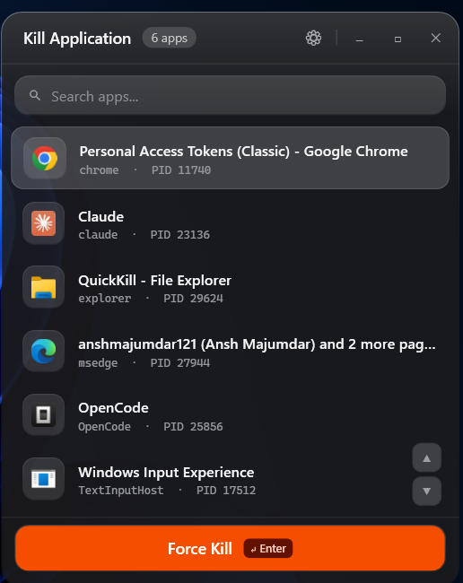
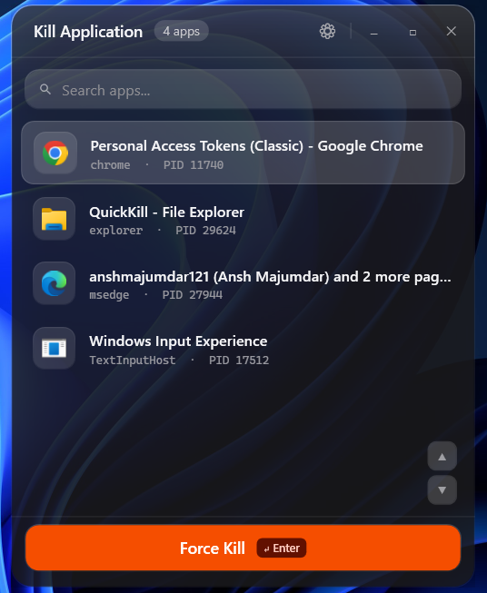
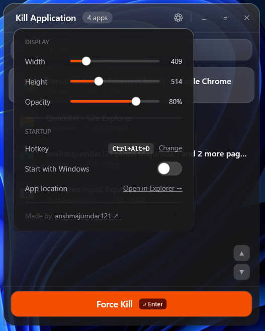

# QuickKill — Windows Process Killer with Global Hotkey

> Kill frozen apps instantly. A dark liquid-glass alternative to Windows Task Manager — one hotkey, one click, done.

[](LICENSE)
[](https://dotnet.microsoft.com/download/dotnet/8.0)
[](https://github.com/anshmajumdar121/QuickKill)
[](https://github.com/anshmajumdar121/QuickKill)

<p align="center">
  
  <br><em>Main kill panel — search any running app, select with ↑/↓, kill with Enter</em>
  <br><br>
  
  <br><em>Live search — type to filter instantly across all running apps</em>
  <br><br>
  
  <br><em>Settings panel — resize, adjust opacity, remap hotkey, toggle auto-start</em>
</p>

## What is QuickKill?

QuickKill is a **lightweight Windows process killer** that lives in your system tray and opens a dark liquid-glass overlay panel (inspired by iPadOS Control Center) at the press of **Ctrl+Alt+Q**. It shows every running desktop application with its icon and PID, plus a live search box — find and kill any frozen app in under 2 seconds.

Unlike Task Manager (3–5 clicks, several seconds of lag), QuickKill is built for speed: the process list is pre-cached in the background, so the panel opens **instantly** with zero loading time. It also guards critical system processes (csrss, wininit, lsass, etc.) so you can never accidentally blue-screen your machine.

## Why QuickKill over Task Manager?

| Feature | QuickKill | Windows Task Manager |
|---|---|---|
| Open speed | Instant (pre-cached) | 3–5 s lag |
| Hotkey | Ctrl+Alt+Q (customizable) | Ctrl+Shift+Esc |
| Clicks to kill | 2 (hotkey → Enter) | 4–6 |
| Dark liquid-glass UI | ✅ | ❌ |
| Live search | ✅ Type to filter | ❌ |
| Keyboard navigation | ✅ ↑/↓ + Enter, never leave search box | Partial |
| Critical process guard | ✅ Built-in | ⚠️ Basic |
| Background refresh | ✅ Every 4s, cached | ✅ Real-time |
| Customization | ✅ Size, opacity, hotkey | ❌ |
| Memory usage | ~8 MB | ~40–80 MB |
| Open source | ✅ MIT | ❌ |

---

## 🚀 Quick Start (Easiest Way)

### Option 1 — Download & run (recommended for most users)

1. Download the latest `QuickKill.zip` from the [Releases page](https://github.com/anshmajumdar121/QuickKill/releases/latest)
2. Extract anywhere (e.g. `C:\Apps\QuickKill`)
3. Double-click **`QuickKill.exe`** — a balloon tip confirms it's running in the system tray
4. Press **Ctrl+Alt+Q** — the panel appears

> **Requires:** [.NET 8 Desktop Runtime](https://dotnet.microsoft.com/en-us/download/dotnet/8.0) (one-time install, most PCs already have it). If `QuickKill.exe` won't start, install the runtime first.

### Option 2 — One-line terminal launch

```powershell
Start-Process "C:\Apps\QuickKill\QuickKill.exe"
```

Restart it cleanly during testing:

```powershell
Get-Process QuickKill -ErrorAction SilentlyContinue | Stop-Process -Force; Start-Process "C:\Apps\QuickKill\QuickKill.exe"
```

### Option 3 — Set it and forget it (best long-term)

1. Launch QuickKill once
2. Press **Ctrl+Alt+Q** → click the **⚙** gear icon → toggle **Start with Windows** ON
3. Done — QuickKill now starts silently with every boot. You never think about it again; just press Ctrl+Alt+Q whenever an app freezes.

---

## Usage

| Action | How |
|---|---|
| Open / close the panel | **Ctrl+Alt+Q** (toggles) |
| Search | Just start typing |
| Navigate list | **↑ / ↓** (works while typing in search) |
| Kill selected app | **Enter** or click **Force Kill** |
| Close panel | **Esc**, click outside, or **✕** |
| Open from tray | Double-click the tray icon |
| Quit completely | Right-click tray icon → **Exit** |

If Ctrl+Alt+Q is already taken by another app, QuickKill automatically falls back to **Ctrl+Shift+Q** (the tray tooltip always shows the active hotkey).

## ⚙ Settings Panel

Click the **gear icon (⚙)** in the panel header:

- **Width / Height sliders** — resize the panel (360–700 × 400–780 px), saved permanently
- **Opacity slider** — adjust glass transparency from 15% to 100%
- **Hotkey** — click **Change**, press any new combination (e.g. Ctrl+Shift+K), done. Conflicts are detected automatically.
- **Start with Windows** — toggle auto-launch at boot
- **App location** — opens the install folder in Explorer

All settings persist to `%AppData%\QuickKill\settings.json`.

## Features

- **Instant open** — process list is pre-cached every 4 s by a background thread; the panel renders in one frame with zero flicker
- **Global hotkey** — system-wide, customizable, with `MOD_NOREPEAT` so it never double-fires
- **Dark liquid-glass UI** — rounded 18px corners, specular sheen, frosted layers, thin glass scrollbar
- **Live search** — launcher-style filtering as you type
- **Full keyboard flow** — type → ↑/↓ → Enter, without ever touching the mouse
- **Window controls** — minimize, maximize, close buttons + draggable header
- **Scroll buttons** — floating ▲/▼ for mouse-only users
- **Safety guard** — cannot kill csrss, wininit, winlogon, services, lsass, smss, dwm, System, Registry, or Idle
- **Background refresh** — process list updates every 4 seconds so the panel opens instantly
- **Graceful kill** — sends `CloseMainWindow()` first, waits 3 s, then force-kills
- **Single instance** — a second launch just exits, no duplicate tray icons
- **Icon caching** — each exe's icon is extracted once and reused
- **Smart refresh** — the open panel skips list repaints entirely when nothing changed (no blinking)

## Build from Source

```powershell
git clone https://github.com/anshmajumdar121/QuickKill.git
cd QuickKill
dotnet build -c Release
```

Binary lands at `QuickKill\bin\Release\net8.0-windows\win-x64\QuickKill.exe`.

### Creating a release zip

**Framework-dependent** (small ~1 MB, needs .NET 8 Desktop Runtime on the target PC):

```powershell
dotnet publish QuickKill -c Release -o publish
Compress-Archive publish\* QuickKill.zip
```

**Self-contained** (large ~80 MB, runs on any Windows PC with zero installs):

```powershell
dotnet publish QuickKill -c Release --self-contained -r win-x64 -o publish-sc
Compress-Archive publish-sc\* QuickKill-standalone.zip
```

Upload the zip(s) to a GitHub Release. Recommended: offer both — framework-dependent as the default, self-contained for users who don't want to install the runtime.

## Architecture

```
QuickKill/
├── App.xaml.cs                      # Startup, tray icon, single-instance mutex, hotkey wiring
├── KillWindow.xaml(.cs)             # The glass panel — list, search, settings popup
├── HotkeyManager.cs                 # RegisterHotKey P/Invoke + WM_HOTKEY message hook
├── ProcessHelper.cs                 # Process enumeration, background cache, safe kill
├── ProcessItem.cs                   # Per-process model + icon cache (ConcurrentDictionary)
├── AppSettings.cs                   # JSON settings persistence (%AppData%\QuickKill)
└── AttributionPasswordDialog.xaml(.cs)  # SHA-256 protected developer attribution
```

Key design decisions:

- **Framework-dependent build** — 1 MB exe instead of an 80 MB self-extracting single file, so launch is instant
- **`asInvoker` manifest** — no UAC prompt on every start (elevated processes simply can't be killed, which is the safe default)
- **WPF-native transparency** — rounded corners stay clean; the Win32 acrylic API was removed because it forces a rectangular window region
- **`ListBox` not `ListView+GridView`** — GridView without columns silently breaks WPF arrow-key navigation
- **No open/close animations** — transparent layered windows with `DropShadowEffect` render in software; animating them causes visible stutter

## FAQ

### Is QuickKill safe?
Yes. Critical system processes are filtered out entirely, and every kill attempts a graceful `CloseMainWindow()` (3 s grace) before force-terminating.

### Is this a virus?
No — fully open source under MIT. Every line is in this repo; build it yourself and compare.

### The hotkey doesn't work?
Another app probably owns Ctrl+Alt+Q. QuickKill falls back to **Ctrl+Shift+Q** automatically — hover the tray icon to see the active hotkey, or set your own in ⚙ Settings → Hotkey → Change.

### The panel doesn't appear?
Make sure QuickKill is actually running (check the system tray). If you clicked ✕ earlier, that only hides the panel — the app keeps running and the hotkey still works. To fully quit: right-click tray icon → Exit.

### Windows 11 support?
Yes — built and tested on Windows 11; works on Windows 10 too.

## Roadmap

- [x] ~~Configurable hotkey remapping~~ ✅ Done (v2)
- [x] ~~Panel size & opacity customization~~ ✅ Done (v2)
- [x] ~~Start with Windows~~ ✅ Done (v2)
- [ ] Dark/Light theme toggle
- [ ] Port number detection (show which port each process occupies)
- [ ] Installer (WiX / Inno Setup)

## Contributing

Contributions welcome — see [CONTRIBUTING.md](CONTRIBUTING.md).

## License

MIT — see [LICENSE](LICENSE).

## Author

Made by [**anshmajumdar121**](https://github.com/anshmajumdar121) · Attribution is cryptographically locked in-app (SHA-256).

Built with [WPF](https://learn.microsoft.com/en-us/dotnet/desktop/wpf/) (.NET 8) and the Windows API (`user32.dll`).
